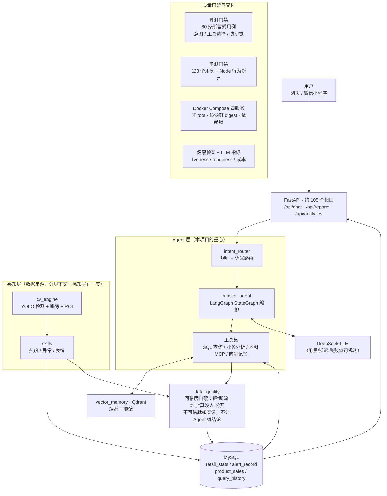

# 智能零售分析系统 v4

<p>
  <a href="https://github.com/gaowanyu2027/Retail_assistant_v4/actions/workflows/eval-gate.yml">
    
  </a>
  
  
  
  
</p>

面向线下门店的 **AI Agent 落地系统**：Agent 通过**工具调用**消费结构化经营数据，
完成自然语言问答与运营归因，最终通过**网页与微信小程序双端**交付。

> **这是 Agent 项目，不是 CV 项目。** 摄像头只是**感知层**（数据来源）——
> 真正的工程重心在：**Agent 编排与工具调用**、**断言式评测与 CI 门禁**、
> **数据可信度门禁（防 Agent 编结论）**、**外部依赖的熔断/舱壁**、**LLM 用量与成本可观测**。

核心主张是**先保证数据可信、再给出结论**——设备故障与"真实零客流"被明确区分，
数据来源（真实接入 / 演示 / 测试）显式标注，避免 Agent 用不可信数据给出自信的错误结论。

### 四个能自己复现的硬数字（都是 Agent 侧问题）

| # | 问题 | 结果 | 怎么验 |
|---|---|---|---|
| 1 | **评测不可信**：Agent 的行为（意图/工具选择/是否编造）靠"看起来对"没法防回归 | 自建 **80 条断言式评测集**（含**防幻觉负面断言**与多轮用例），接入 CI 双门禁，**不依赖 LLM 自评** | 见下方「Agent 侧证据」；`python evals/run_evals.py` |
| 2 | **外部依赖打嗝拖垮 Agent**：Qdrant 抖动时 40 并发把线程池吃光 | 熔断 + 舱壁后 `/api/chat/search` 中位延迟 **86.2s → 2.09s** | [`改进记录.md`](改进记录.md) 模块 C（A/B 脚本 + 原始数字） |
| 3 | **数据不可信时 Agent 会自信地编结论**：断流写的 0 被当成"客流低谷"，演示数据混进真实时段分析 | 加可信度门禁 + 来源标注后，"高峰 19:00（270 人次）"这类结论会被明确标注**全部来自演示数据**（真实采集为 0） | 同模块 A8（`retail_stats` 加 `source` 列 + 实机 A/B） |
| 4 | **成本不可见**：定时汇报固定 **10 分钟一轮 = 144 次/天/店**，但没人知道花了多少 | ① 新增 LLM 指标（用量/延迟/失败率/**按用途归因**）② 加**变化门控**：没变化就跳过 LLM 走模板，静默时段 **144 → ≤24 次/天（-83%）** | `GET /api/metrics/llm`（含 `report_gate`）；实测：单次汇报 317+94 tokens / 1.4s，无变化轮不花 token |

> 这类修复在本项目共 **50+ 条已修 / 30+ 条待修**，每条都按「问题 → 复现 → 根因 → 修复 → 验证 → 诚实边界」记录在
> [`改进记录.md`](改进记录.md)（4000+ 行工程纪实，含**踩过的弯路**与未验证项标注）。

## 架构



> 想先看**感知层（CV）怎么接进来的**？见文末「感知层」一节 —— 它在本项目里的定位是
> **数据来源**：`open_source` 统一入口 → CV 管线 → skills → 落库，之后就交给 Agent 了。

## 能力一览

| 维度 | 现状 |
|---|---|
| **Agent** | **21 个模块**：意图路由 → LangGraph StateGraph 编排 → DeepSeek；工具含 SQL 查询、业务分析、地图 MCP、向量记忆；**LLM 用量/延迟/成本可观测**（按用途归因） |
| **评测与质量** | **80 条断言式评测集**（意图 / **工具选择** / 关键词 / **防幻觉负面断言** / 多轮）+ **123** 个单测用例 + Node 行为断言；**CI 双门禁**，不依赖 LLM 自评 |
| **可靠性** | 向量层熔断 + 舱壁、外部依赖降级、**静默失败治理**（错误通道、看门狗）、健康检查 liveness/readiness 分离 |
| **数据可信度** | 断流与真实零值分离、来源显式标注（`pos`/`simulated`/`test`/`video`）、问答链路带可信度门禁 |
| **接口** | 约 **105** 个（13 个路由模块：问答 / 分析 / 报告 / 视频流 / 鉴权 / 地图 / 语音 / TTS） |
| **数据层** | MySQL（业务）+ SQLite（鉴权 / 降级回退）+ Qdrant（向量，熔断 + 舱壁）+ Redis（常驻） |
| **安全** | 登录鉴权 + 双角色权限矩阵（26 个门禁点）、会话滑动续期、**工具调用的入参校验与 SSRF 守卫**、上传四道约束、安全响应头 |
| **感知层（CV）** | YOLO 行人检测 + 跟踪 + ROI 热度、异常行为告警、人脸表情识别；按机位类型加载模块 |
| **交付** | Docker Compose 四服务、**非 root** 容器、镜像 `tag@digest`、`requirements.lock.txt` 精确重建 |

## Agent 侧证据（面试最常被追问的三件事）

### ① "你的 Agent 怎么评测？" —— 80 条**断言式**用例，不靠 LLM 自评

| 断言维度 | 条数 | 防的是什么 |
|---|---|---|
| `expect_intent` 意图路由 | **80** | 问题被路由到错误的分析模板 |
| `expect_tools` **工具选择** | **54** | 该调工具时不调 / 调错工具 |
| `expect_no_tools` | 3 | **不该调工具时乱调**（浪费 token + 慢） |
| `expect_keywords` / `_any` 内容断言 | 37 / 41 | 答非所问、结论缺关键数据 |
| `expect_no_keywords` | 7 | **幻觉与越界表述**（说了不该说的） |
| `dialog` + `check_turn` 多轮 | 6 | 上下文丢失、指代错误 |
| `preload_history` | 1 | 历史注入失效 |

判定是**确定性断言**（实际调用工具 ⊇ 期望工具、关键词必须出现/禁止出现），
失败即 CI 拦截 ✓ —— 这也是它能进 CI 门禁的前提。

### ② "数据不对时 Agent 会不会胡说？" —— 可信度门禁（这是 LLM 特有的坑）

- 摄像头断流写下的 `0` 与"真的没客人"**在数据库里长得一样** → 原实现据此给出"低谷时段安排陈列调整"的误导建议 ✗
  现在：可信度门禁把两者分开，问答与汇报链路都会**如实回答"数据不可信/未采集"** ✓
- 演示数据（`simulated`）与真实采集混在一张表 → 修复前"高峰 19:00（270 人次）"**全部来自演示数据**，
  真实采集为 0 ✗ 现在：来源显式列 + 结论里标注 ✓

### ③ "成本和延迟你怎么管？" —— 先有指标，再有优化

```powershell
curl -H "Authorization: Bearer <token>" http://127.0.0.1:8000/api/metrics/llm
```

返回：`calls / errors / error_rate`、`prompt_tokens / completion_tokens`、
延迟 `p50/p95/max`（最近 500 次有界窗口）、**`by_tag`（answer / report / summary / title）**、
`by_model`、**`report_gate`（成本门控：跳过了多少次、为什么）**、
以及**可选** `cost_estimate`（只在配置了单价时给出 —— 价格会变，写死就是错的）。

**实测数据 → 优化 → 再验证**（这条链才是重点）：

| 阶段 | 数据 |
|---|---|
| 先测出来 | 定时汇报单次 **317+94 tokens / 1.4s**；固定 **10 分钟一轮 = 144 次/天/店** ≈ **59k tokens/天** |
| 优化 | **变化门控**：汇报前比业务签名，没变化就不调 LLM（走模板仍有文字）；首次 / 可信度翻转 / 异常突增 / 1 小时心跳**硬性放行**（该说的事不能被门控吞掉） |
| 再验证 | 容器内真跑：首轮调用 → 无变化**跳过**（不花 token）→ 造数据变化后**恢复调用**（不漏报）；`skip_reasons` 按有界类别统计 |
| 收益 | 静默时段 **144 → ≤24 次/天（-83%）**，约 **59k → 10k tokens/天/店**（按上限推算，非长跑统计，已在记录里诚实标注） |

## 快速开始（三步）

```powershell
git clone https://github.com/gaowanyu2027/Retail_assistant_v4.git
cd Retail_assistant_v4
copy .env.example .env        # 填 dazuoye_api（LLM Key）与 mysql_root
docker compose up -d --build  # 起 backend + MySQL + Qdrant + Redis
```

打开 **http://127.0.0.1:8000** 登录（root 口令只在鉴权库为空时打印一次；忘了用
`python tools/reset_password.py` 离线重置）。

> 不想用容器？`python run.py` 直接跑宿主（此时**能用本机物理摄像头**；容器模式下 WSL2 看不到设备）。

## 如何复现上面那些数字

```powershell
python tests/run_tests.py                          # 123 个单元用例（零依赖，CI 用的就是它）
python evals/run_evals.py                          # 80 条断言式评测（意图/工具选择/防幻觉，需 MySQL + LLM Key）

# LLM 用量与成本（Agent 侧指标；按用途归因 answer / report / summary / title）
curl -H "Authorization: Bearer <token>" http://127.0.0.1:8000/api/metrics/llm

# 视频源与画面链路（感知层排障，与本项目的 Agent 主线相对独立）
python tools/check_video_sources.py --mint-session            # 逐台摄像头真开一遍
python tools/push_camera_frames.py --source 0 --password '…'   # 跨机器送画面
python tools/observe_tracks.py --mint-session --seconds 30     # 旁观统计 track_id 数 vs 访客数
```

- 逐条修复的**原始数字与 A/B 对照**： [`改进记录.md`](改进记录.md)（按模块归档 + 附四台账）
- 压测报告： `benchmark/reports/`
- 排障记录（真实故障复盘）： 容器化后摄像头打不开、`auth.db` 打不开、构建不可复现等

<!-- ===== 界面预览：把图放进 docs/images/ 后，删掉本行注释标记即可（拍图清单见 docs/images/README.md） =====

## 界面预览

| 自然语言问答（含数据可信度提示） | 评测门禁（80 条断言式用例） |
|---|---|
|  |  |

| 单测与 CI 双门禁 | 实时监控（感知层，可替换） |
|---|---|
|  |  |

| 经营看板（热度/告警/转化） | LLM 用量与成本指标 |
|---|---|
|  |  |
===== -->

### v4 相对 v3 的主要变化

| 维度 | v3 | v4 |
|---|---|---|
| 鉴权 | 完全开放 | 账号密码登录 + root/platform 双角色 + 限流 + 一次性票据 |
| 端 | 仅网页 | 网页 + **微信小程序**（各自适配鉴权） |
| Agent | 8 个工具、函数式汇报 | **15 个工具** + **LangGraph StateGraph** 汇报工作流 |
| 数据可信 | 无 | **可信度门禁** + **来源显式标注**（pos/simulated/test） |
| 业务能力 | 仅当前统计 | **同期对比**（昨天/上周）+ 销量接入与**目录自动同步** |
| CV | 单路 | **多摄像头模块化**（按标签加载、数据隔离、多路真并行） |
| 质量 | 手动跑评测 | 80 条评测集 + **CI 门禁** + 压测驱动优化（QPS 6×） |

## 项目介绍

系统主要包含以下能力：

- 零售视频分析：YOLO 行人检测 + ByteTrack 跟踪 + ROI 货架热度统计
- 异常行为分析：轨迹异常、绕过收银台、人群聚集等告警
- 人脸表情分析：入口摄像头人脸检测 + 表情识别 + SQLite/MySQL 记录
- 本地语音唤醒：sherpa-onnx KWS，支持“小零”等唤醒词
- 本地指令识别：唤醒后使用 sherpa-onnx 流式 ASR 识别指令
- 语音回复：edge-tts 服务端 TTS，手机端也可播放
- 自然语言问答：LangChain Agent + DeepSeek，支持流式回答
- 会话记录：新建、保存、切换、重命名、删除会话
- MySQL 持久化：表情、问答历史、会话、语音日志、TTS 缓存、视频记录、ROI 配置
- 向量召回：Qdrant 本地模式 + Ollama bge-small-zh-v1.5

## 技术栈

- Python 3.13
- FastAPI + Uvicorn + WebSocket
- Ultralytics YOLO26n + ByteTrack
- PyTorch + OpenCV
- sherpa-onnx：KWS 唤醒 + 流式中文 ASR
- edge-tts：服务端中文语音合成
- LangChain + DeepSeek：Agent 问答
- MySQL：业务数据持久化
- Qdrant + Ollama：查询历史向量召回
- HTML/CSS/JS：前端界面

## 目录结构

```text
.
├── agents/                  # LangChain Agent + 模块注册表 + 百度地图工具 + 数据可信度/同期对比
├── api/                     # FastAPI 路由 + 鉴权（security.py / routes/auth.py）
├── config/                  # 全局配置 + ROI + cameras.yaml
├── cv_engine/               # YOLO、跟踪、表情、ROI、多路视频引擎
├── skills/                  # 热度、告警、表情 + 客流/空货架模块
├── frontend-vue/            # 浏览器前端（Vue3 + Vite，唯一前端）
├── miniprogram/             # 微信小程序端（问答/看板/监控/摄像头管理/语音）
├── evals/                   # 自动化评测集（80 条）+ CI 门禁
├── benchmark/               # 并发压测脚本与报告
├── data/                    # 运行时数据：SQLite、鉴权库、销量投递目录、日志
├── 改进记录.md               # v3 → v4 改进记录（问题/做法/验证/收益）
├── all_models/              # sherpa-onnx 语音模型
├── sherpa-onnx-kws-*        # KWS 唤醒词模型
├── yolo26n.pt               # YOLO 小模型
├── best.pt                  # 人脸检测模型
├── mobilenetv3_fer_best.pth # 表情识别模型
├── mysql_db.py              # MySQL 数据层
├── vector_memory.py         # Qdrant 向量召回
├── requirements.txt
└── run.py
```

> 注：`frontend/`（原生 JS 版前端）已在 v4 移除，Vue 为唯一浏览器前端。

## 环境安装

### 1. 创建 Python 环境

推荐使用 Conda：

```powershell
conda create -n py313 python=3.13 -y
conda activate py313
```

### 2. 安装依赖

在项目根目录执行：

```powershell
pip install -r requirements.txt
```

如果缺少 PyMySQL、qdrant-client、edge-tts，也可以单独安装：

```powershell
pip install PyMySQL qdrant-client edge-tts
```

### 3. 配置环境变量

系统从环境变量读取密钥与配置：**密钥不在代码与仓库中硬编码**（库名、上游地址等非密配置仍写在代码/编排里，例如 `mysql_db.MYSQL_DB`、`LLM_BASE_URL`）。下面是**常用清单**（不是全集——代码实际读取 50+ 个变量，完整项见 `.env.example` 与 `config/settings.py`），标注了**必选 / 可选**。

> 提示：可用 Windows 用户环境变量（`$env:xxx`）或 `.env` 文件。若用 `.env`，请在项目根目录创建且**不要提交**（`gitignore` 已忽略 `.env`）；模板见下方 `.env.example`。

#### 必选（核心功能启动需要）

| 变量 | 用途 | 示例 |
|---|---|---|
| `dazuoye_api` | **DeepSeek API Key**（Agent 问答、LLM 调用） | `sk-xxxx` |
| `mysql_root` | **MySQL root 密码**（会话/表情/问答持久化） | `你的密码` |
| `baidu_map_ak` | 百度地图**服务端 AK**（竞品/商圈/地理编码/距离） | `百度AK` |
| `baidu_map_sk` | 百度地图**服务端 SK**（sn 签名，检索/矩阵必需） | `百度SK` |

```powershell
$env:dazuoye_api    = "你的DeepSeek API Key"
$env:mysql_root     = "你的MySQL密码"
$env:baidu_map_ak   = "你的百度地图AK"
$env:baidu_map_sk   = "你的百度地图SK"
```

> **没有配置 `mysql_root` 时**：系统自动回退到 SQLite（`data/agent_checkpoints.db`），不会写 MySQL，启动日志会提示。

#### 可选（增强/切换功能）

| 变量 | 用途 | 默认值 | 说明 |
|---|---|---|---|
| `MYSQL_HOST` | MySQL 主机 | `127.0.0.1` | 远程 MySQL 时改 |
| `MYSQL_PORT` | MySQL 端口 | `3306` | |
| `MYSQL_USER` | MySQL 用户 | `root` | |
| `SANITIZE_FACES` | 人脸脱敏开关 | `0`（关） | 设 `1` 启用推帧/展示时对人脸打码（合规） |
| `QDRANT_URL` | Qdrant Server 地址 | 空（嵌入式） | 设置后启用 **Server 模式**（Docker/多进程/多机） |
| `QDRANT_API_KEY` | Qdrant Server 密钥 | 空 | 云托管/带认证时填 |
| `QDRANT_PATH` | 本地嵌入向量库目录 | `qdrant_data/` | 仅嵌入式模式用 |
| `SHERPA_ONNX_PROVIDER` | 本地语音推理设备 | `cpu` | 有 CUDA 可设 `cuda` |
| `BAIDU_MCP_ENABLED` | 百度官方 MCP 叠加 | 空 | 设 `1` 启用 14 个通用地图工具 |
| `LANGFUSE_PUBLIC_KEY` | Langfuse 可观测 Public Key | 空 | 与 Secret Key 齐了才启用 Trace |
| `LANGFUSE_SECRET_KEY` | Langfuse 可观测 Secret Key | 空 | 同上 |
| `LANGFUSE_HOST` | Langfuse 服务地址 | `https://cloud.langfuse.com`（SDK 默认） | **自托管时必填**：本机直跑用 `http://localhost:3000`，容器内用 `http://host.docker.internal:3000`；不填会静默上报到 Langfuse Cloud |

> ⚠ **`MYSQL_HOST` / `MYSQL_PORT` / `MYSQL_USER` / `QDRANT_URL` 只在本机直跑时生效**：
> `docker compose` 会用自己的 `environment` 段覆盖它们（连服务名 `mysql` / `qdrant`）。
> 容器部署下要改这些，请改 `docker-compose.yml`，改 `.env` 没用。

```powershell
# 可选：启用功能时再设（不设则用默认值）
$env:SANITIZE_FACES         = "1"     # 人脸脱敏
$env:SHERPA_ONNX_PROVIDER   = "cuda"  # 本地语音用 GPU
$env:BAIDU_MCP_ENABLED      = "1"     # 百度 MCP
```

#### `.env.example` 模板（可复制使用）

> 复制为 `.env` 并填入真实值，**不要提交 `.env`**。
> 下面只是**节选**；`.env.example` 里还有整段「登录鉴权（可选）」变量
> （`AUTH_ENABLED` / `AUTH_ROOT_USERNAME` / `AUTH_SESSION_HOURS` / 登录限流三项 /
> `AUTH_MIN_PASSWORD_LEN` / `AUTH_COOKIE_SECURE` / `AUTH_CORS_ORIGINS` / `AUTH_PUBLIC_DOCS` 等）。

```ini
# ===== 必选 =====
dazuoye_api=你的DeepSeek API Key
mysql_root=你的MySQL密码
baidu_map_ak=你的百度地图AK
baidu_map_sk=你的百度地图SK

# ===== 可选 =====
# MYSQL_HOST=127.0.0.1
# MYSQL_PORT=3306
# MYSQL_USER=root
# SANITIZE_FACES=1
# QDRANT_URL=http://localhost:6333
# QDRANT_API_KEY=
# QDRANT_PATH=qdrant_data/
# SHERPA_ONNX_PROVIDER=cpu
# BAIDU_MCP_ENABLED=1
# LANGFUSE_PUBLIC_KEY=
# LANGFUSE_SECRET_KEY=
# LANGFUSE_HOST=http://localhost:3000

# ===== 登录鉴权（可选，完整项见 .env.example）=====
# AUTH_ENABLED=1
# AUTH_ROOT_USERNAME=root
# AUTH_ROOT_PASSWORD=            # ≥8 位且不在弱口令表里，否则回退随机口令
# AUTH_SESSION_HOURS=12
# AUTH_COOKIE_SECURE=0           # HTTPS 部署请置 1
# AUTH_PUBLIC_DOCS=0             # 置 1 则 /docs 免登录
```

#### Ollama（可选，向量召回用）

启动 Ollama，并安装中文向量模型：

```powershell
ollama pull qllama/bge-small-zh-v1.5
```

默认向量库目录为项目下的 `qdrant_data/`，可通过环境变量修改：

```powershell
$env:QDRANT_PATH = "D:/你的目录/qdrant_data"
```

## 模型下载指引

### YOLO26n

项目推荐使用 `yolo26n.pt`。

如果项目根目录没有该文件，可以执行：

```powershell
python -c "from ultralytics import YOLO; YOLO('yolo26n.pt')"
```

也可以从其他已有项目复制到项目根目录（例如本地已下载的 yolo26n.pt 文件）。

### 人脸检测模型

项目需要：

```text
best.pt
```

该模型是 YOLOv8n-face 转换或导出的权重，请放在项目根目录。

### 表情识别模型

项目需要：

```text
mobilenetv3_fer_best.pth
```

请放在项目根目录。

### KWS 唤醒词模型

从 ModelScope 下载：

```powershell
git lfs install
git clone https://www.modelscope.cn/pkufool/sherpa-onnx-kws-zipformer-wenetspeech-3.3M-2024-01-01.git
```

克隆后放到项目根目录：

```text
sherpa-onnx-kws-zipformer-wenetspeech-3.3M-2024-01-01
```

目录内需要包含：

```text
tokens.txt
encoder-epoch-12-avg-2-chunk-16-left-64.int8.onnx
decoder-epoch-12-avg-2-chunk-16-left-64.onnx
joiner-epoch-12-avg-2-chunk-16-left-64.int8.onnx
keywords.txt
```

### 流式中文 ASR 模型

项目使用：

```text
all_models/sherpa-onnx-streaming-zipformer-zh-14M-2023-02-23
```

如果该目录不存在，可以从 HuggingFace 下载：

```text
https://huggingface.co/csukuangfj/sherpa-onnx-streaming-zipformer-zh-14M-2023-02-23
```

下载后解压到：

```text
all_models/sherpa-onnx-streaming-zipformer-zh-14M-2023-02-23
```

目录内需要包含：

```text
tokens.txt
encoder-epoch-99-avg-1.int8.onnx
decoder-epoch-99-avg-1.int8.onnx
joiner-epoch-99-avg-1.int8.onnx
```

### Ollama 向量模型

```powershell
ollama pull qllama/bge-small-zh-v1.5
```

模型名：`qllama/bge-small-zh-v1.5`，向量维度 512。

## 启动项目

```powershell
conda activate py313
$env:dazuoye_api = "你的DeepSeek API Key"
$env:mysql_root = "你的MySQL密码"
python run.py --port 8000
```

访问：

- 前端页面：http://localhost:8000
- API 文档：http://localhost:8000/docs （**默认需要登录**，见下方登录说明）

> 前端为 **Vue 构建版**（`frontend-vue/dist`，v4 起为唯一浏览器前端）。若构建产物缺失或不完整，
> 服务端会在终端打印告警并显示"前端未构建"提示页；此时执行 `cd frontend-vue && npx vite build` 重新构建即可。
> 浏览器端若 Vue 加载失败（资源缺失/挂载超时/未处理异常），页面会提示刷新并在终端输出原因。
>
> **登录**：v4 起 `/api/*` 与**接口文档**（`/docs`、`/redoc`、`/openapi.json`）默认都需要登录
> （`AUTH_PUBLIC_DOCS=1` 可放开文档）。root 账号与随机密码**只在鉴权库里一个账号都没有时**
> 才会自动创建并打印（即首次初始化 `data/auth.db`；已有账号时启动不再打印），
> 也可用环境变量 `AUTH_ROOT_PASSWORD` 预先指定（需 ≥8 位且不在弱口令表，否则回退随机口令）。
> 忘了密码用 `python tools/reset_password.py` 离线重置。
>
> **视频源打不开时先跑体检**：`python tools/check_video_sources.py --user root --password '你的密码'`
> 会把配置里的每台摄像头**真开一遍**，逐台报告"出没出画面 / 卡在哪一步 / 报什么错误码"
> （容器里 `webcam` 这类物理设备必然不可用，它会直接说明原因）。
>
> **服务器看不到物理摄像头时，用推帧工具把画面"喂"进来**：
> `python tools/push_camera_frames.py --source 0 --user root --password '你的密码'`
> （`--source` 可以是本机设备号 `0`、视频文件路径、或 `rtsp://…`）。
> 原理是走已有的上行通道 `/api/ws/client`（浏览器「本地摄像头」用的就是它），
> 所以**摄像头在哪台机器上不重要，能跑这个脚本、能连到服务端就行**。

启动后终端应看到：

```text
[OK] 数据写入: MySQL Retail_assistant
[OK] 查询历史向量索引完成: N 条
```

## 容器化运行（Docker Compose）

除上面的本地直跑方式外，也可用 Docker 一键拉起**业务侧**全套服务。

### 前置

```powershell
copy .env.example .env      # 填入 dazuoye_api / mysql_root 等（.env 已被 gitignore）
```

### 启动

```powershell
docker compose up -d --build
docker compose logs -f backend     # 观察启动日志（root 口令只在鉴权库为空时打印一次）
```

访问 **http://localhost:8000**。停止：`docker compose down`（MySQL/Qdrant/Redis 的数据在命名卷里，不会丢；应用侧的 `./data` 是 bind mount，`down` 不带 `-v` 同样保留）。

### 编排内容

| 服务 | 镜像 | 宿主端口 | 说明 |
|---|---|---|---|
| `backend` | 本项目（多阶段构建，**非 root 用户运行**） | **8000** | FastAPI + Agent + 前端静态资源 |
| `mysql` | `mysql:8.0.46`（钉版本，见「镜像与依赖版本」） | `127.0.0.1:3306`（仅本机） | 业务数据（`depends_on` + healthcheck 确保就绪后再起后端） |
| `qdrant` | `qdrant/qdrant:v1.19.0`（已钉，见「镜像与依赖版本」） | 不发布 | 向量检索（Server 模式，支持多进程） |
| `redis` | `redis:7.4-alpine`（钉到小版本） | 不发布 | **常驻**（本项目的缓存层）。代码当前尚未读写 Redis，见下方「Redis 定位」 |

> **端口**：`backend` 发布 `8000`；`mysql` 为了用 Navicat 等 GUI 连库，按需发布为
> **`127.0.0.1:3306`（只绑本机、不对局域网开放）**，不想要就把 `docker-compose.yml` 里那段 `ports` 注释掉；
> `qdrant` / `redis` 的 `ports` 默认注释、仅在 compose 网络内通过服务名访问，要用 `redis-cli` 等调试时再取消注释。

### 健康检查：liveness 与 readiness 分开

| 端点 | 语义 | 查依赖 | 用途 |
|---|---|---|---|
| `/api/health` | **liveness**：进程还在跑吗 | 不查 | 兼容旧监控；匿名只返回 `{"status":"ok"}`，登录后附带设备/运行时长 |
| `/api/health/ready` | **readiness**：现在能干活吗 | **真去 ping** | Docker `HEALTHCHECK` 与编排探活 |

就绪探针的判定策略（有意区分"致命"与"降级"）：

- **MySQL 不可用 → 503**：业务数据读写全废，服务等于不能用
- Qdrant 不可用 → 仍 200，但列入 `degraded`：向量召回退化为关键词，主链路
  （问答 / 报表 / 鉴权）不受影响，不该因此判死
- `redis` **不参与探测、也不会出现在 `degraded` 里**：代码当前尚未读写 Redis（缓存层待接入），
  为它探测等于自欺（详见下方「Redis 定位」）
- CV 引擎未初始化 → 列入 `degraded`（容器内没有摄像头属预期）

```powershell
curl http://localhost:8000/api/health/ready
# {"status":"ok","critical":{"mysql":true},"degraded":[],"detail":{}}
# MySQL 停掉时： HTTP 503
# {"status":"unavailable","critical":{"mysql":false},"detail":{"mysql":"OperationalError"}}
```

> **为什么必须两个都有**：本项目实际发生过"MySQL 口令没传进容器 → 后端静默回退 SQLite
> → `/api/health` 依然 200 healthy → 编排与看板全以为正常，但业务数据一条都读不到"。
> liveness 探针**天然发现不了**这类问题。修好后该场景会立刻变 `unavailable`。

### 镜像与依赖版本（可复现性）

钉版本的原则：**只钉"实测确认过的"版本**，不猜——基础镜像钉错方向可能比本地存储更旧，
Qdrant 这类有存储格式的组件会直接拒绝启动；而乱写一个不存在的 tag 会让你下次 `compose up` 直接失败。
所以下面每个 digest/tag 都是**从本地在跑的镜像或构建缓存里读出来的真值**。

| 项 | 现状 | 真值来源 |
|---|---|---|
| `mysql` | `mysql:8.0.46@sha256:7dcddc01…`（tag + digest） | 容器内 `SELECT VERSION()` |
| `qdrant` | `qdrant/qdrant:v1.19.0@sha256:057ee3a8…` | 容器内 `GET /` 的 `version` |
| `redis` | `redis:7.4-alpine@sha256:e7723ff7…` | 容器内 `redis-server --version` → 7.4.10 |
| `backend` 基础镜像 | `python:3.13-slim@sha256:9d2e5553…`、`node:22-alpine@sha256:c610fcdf…` | BuildKit 缓存里"本次构建实际拉取"的记录 |
| `backend` Python 依赖 | `requirements.lock.txt`（122 个包全部钉版本） | 容器内 `pip freeze` |

`tag@digest` 的含义：**拉取以 digest 为准** —— 既能一眼看出版本，又不依赖该 tag 是否还在、
也不怕 tag 被悄悄改指向。这才是真正可复现。

**Python 依赖的两条安装路径**（`Dockerfile` 里的 `USE_LOCK` 开关）：

```powershell
docker compose build backend                  # 默认：按 requirements.txt 的版本下界解析（及时拿到上游修 bug）
docker compose build backend --build-arg USE_LOCK=1   # 精确：按 requirements.lock.txt 逐包钉死
```

想生成/更新锁文件时**必须在容器内**执行（宿主机环境与镜像不一致，拿宿主机的 `pip freeze`
当锁是错的）：

```powershell
docker compose exec -T backend python -m pip freeze > requirements.lock.txt
```

需要**连基础镜像的补丁版本也钉住**时（本仓库已用 digest 钉了），可用同样的方式取：

```powershell
# 经典镜像库里有的（如 mysql/qdrant/redis）
docker inspect --format '{{index .RepoDigests 0}}' mysql:8.0.46
# 只存在于 BuildKit 构建缓存里的基础镜像（如 python/node）
docker buildx du --verbose | Select-String -Pattern 'pulled from .*(python|node)'
```
>
> 实测：停 MySQL 后 readiness 立即 503、恢复后**自动回 200（无需重启 backend）**。

### 日志轮转（避免吃满磁盘）

四个服务都配了 `json-file` 驱动的轮转（`max-size: 50m` / `max-file: 5`，单服务约 250MB 封顶）。
项目里有约 240 处 `print()` 全走 stdout（实测口径：排除 vendored 与测试脚本），而 Docker 默认**无大小上限**——叠加每 10 分钟一轮的
LLM 汇报与每 60 秒的销量目录扫描，长期运行会把宿主机磁盘逐步吃满，
而磁盘满又会连带 MySQL 写入失败，属于"平时无感、出事很惨"。

### 生产部署还需要什么（当前**有意不做**）

本地开发与单店部署都不需要下面这些；**上线前**才需要，列出来是为了路径清晰：

| 项 | 何时需要 | 说明 |
|---|---|---|
| Nginx 反向代理 | 公网访问 | 统一入口 + HTTPS 终止 + 静态资源缓存。当前 backend 自己提供前端产物且只发布 8000，单机够用 |
| Prometheus + Grafana | 多实例/多店 | 当前用 readiness 探针 + 容器健康状态已够；指标端点尚无，需要时再加 |
| 日志聚合（Loki/ELK） | 多实例 | 当前单机 `docker compose logs` 足够 |
| 消息队列（RabbitMQ/Celery） | 出现真正的异步重任务 | 现在视频处理、定时汇报、销量扫描**已有后台线程**；真正该先修的是"处理线程异常静默死亡"（见 `改进记录.md` 审计待办），而不是引入 MQ |

### 统一入口：一条命令管起全部环境

本项目只依赖 compose 编排的四个服务；但**可观测平台 Langfuse 是独立的一套 compose 栈**
（在 `D:\langfuse\`，有自己的 `.env` 与 postgres 卷）。为此提供一个包装脚本：

```powershell
.\stack.ps1 up       # 启动全部（本项目 + Langfuse）
.\stack.ps1 ps       # 查看全部状态
.\stack.ps1 stop     # 停止全部（保留容器）
.\stack.ps1 down     # 停止并删除容器（卷保留，数据不丢）
.\stack.ps1 logs backend
```

只想操作本项目时，照旧直接用 `docker compose`（行为与以前完全一致）。

> ⚠ **为什么用脚本而不是 compose 的 `include:` 把两个文件合并**
>
> 实测 `include:` 会把被包含文件的服务**并入父项目**，后果很严重：
> 顶层 `name` 变成父目录名（本项目自己的 `name: retail-assistant` 被忽略）、
> 生成一整套**重复容器**与现有容器抢 8000 端口，且 Langfuse 的 postgres 卷名会从
> `langfuse_postgres_data` 变成 `<父项目名>_postgres_data`——**等于换库，
> Langfuse 的历史 trace 会全部"消失"**（其实还在旧卷里，但新容器读不到）。
>
> 用 `-f <各自的文件>` 逐个调用时，每个栈都保持自己的项目名与卷名
> （已验证：Langfuse → `name: langfuse`、卷 `langfuse_postgres_data`），互不干扰。

### Redis 定位（缓存层：先量再缓存）

Redis 已作为**常驻服务**纳入 compose（`--maxmemory 256mb --maxmemory-policy allkeys-lru`，
容量上限与 LRU 淘汰都已设，避免把宿主机内存吃光），但**代码当前还没有读写它**。

**建议按此顺序接入，并且先用 `benchmark/loadtest.py` 量出 MySQL 实际负载再决定缓存什么**，
否则会变成"因为零售系统都该有 Redis"的装饰品：

| 优先 | 用途 | 收益 |
|---|---|---|
| ① | **地图工具缓存**：现有 `_MAP_CACHE` 是进程内 dict，满 500 条时 `clear()` 一次性全清（缓存雪崩） | Redis 的 per-key TTL 天然修掉，且**直接省百度地图 API 配额** |
| ② | **热度/销量聚合查询**：前端每 5 秒轮询多个接口，每个都打 MySQL 聚合 | TTL 5~30 秒即可砍掉绝大部分重复查询 |
| ③ | **embedding 缓存**：`hash(text) -> vector` | 省掉每次语义闸/向量召回的 Ollama 往返 |

**不适合放进 Redis 的（别搬）**：

- **登录会话与限流**：刻意存在独立的 SQLite 鉴权库，保证**业务库故障时管理员仍能登录**；
  搬进 Redis 会削弱该隔离，且 Redis 重启会丢掉限流状态（暴力破解窗口重开）
- **实时视频帧 / `_active_camera`**：高频且体积大，进程内比走网络快


### 四个设计说明

**① 前端在镜像内构建（多阶段）**
`frontend-vue/dist` 被 `.gitignore` 忽略，别人 clone 后没有前端产物。因此 Dockerfile 用
node 阶段执行 `npm ci && npm run build`，再 COPY 进 Python 运行阶段——
**使用者在宿主机无需安装 Node**，`docker build` 一步到位。

**② 模型与数据用挂载，不打进镜像**
`yolo26n.pt` / `best.pt` / `mobilenetv3_fer_best.pth` / `all_models/` / KWS 模型
以只读卷挂载，`data/`（含鉴权库、销量投递目录）为可写挂载。这样镜像更小，也符合
"模型权重不进镜像"的做法。

**③ 摄像头与 GPU 留在边缘（本地）**
本编排覆盖的是"**云端/业务侧**"——业务 API、Agent 问答、数据存储。
容器内直通摄像头/GPU 在 Windows 上尤其别扭，且原始视频流不该走公网，因此建议：

```
边缘（本地/店内）:  摄像头 → YOLO 推理 → 结构化结果
                                    ↓（只传几 KB 的 JSON）
云端（本编排）:    业务 API + Agent + MySQL/Qdrant + 多端展示
```

容器内没有视频源时，**数据可信度门禁**会明确提示"视频源未启动，数据不可信"，
而不会把 0 当作业务结论——这正好可以通过 `GET /api/reports/data-quality` 观察到。

**④ 密钥不进镜像（`.dockerignore` 挡住 `.env`）**
Dockerfile 有 `COPY . .`，会把它能看到的**一切**烤进镜像层。若 `.env` 被拷进去，
任何人 `docker run --rm -it <镜像> cat /app/.env` 就能拿到 API Key 与数据库口令，
而且该层会**永久留在镜像历史里**（即使后续删除文件也仍可挖出）。
因此 `.dockerignore` 显式排除 `.env` / `.env.*` / `*.pem` / `*.key`——
环境变量一律由 `env_file` 在**运行时**注入。这与 `.gitignore` 的规则是两套独立机制，
**只加 `.gitignore` 并不防 Docker**，容易漏。

### 从 `docker run` 迁移过来（重要）

若宿主机上已有以 `docker run` 启动的 MySQL/Qdrant，**必须先停掉再 `docker compose up`**：

```powershell
docker ps                       # 确认容器名，例如 mysql-main / qdrant
docker stop mysql-main qdrant
```

原因是**共享卷**：本编排复用同名卷（`mysql8_volume` / `qdrant-docker`），
而**同一个卷被两个 MySQL 同时挂载会损坏数据文件**。
（本编排里 3306 只绑在 `127.0.0.1`、6333 默认不发布，所以这里主要不是端口冲突问题；
但旧实例若用的是别的端口映射，仍可能撞上 `8000`。）

复用卷的好处是**数据完整保留**，不用重新导。谨慎起见先备份：

```powershell
docker exec mysql-main mysqldump -uroot -p retail_assistant > backup.sql
```

## 功能使用

### 视频分析

点击顶部“摄像头”，可选择：

- 服务器摄像头：服务端 OpenCV 采集
- 本机摄像头：浏览器 getUserMedia 采集

摄像头启动后，按钮会变为“切换摄像头”。

### 语音助手

1. 点击顶部“语音输入”
2. 允许麦克风权限
3. 说“小零”
4. 系统回复“我在”
5. 在 5 秒内说“打开摄像头”

语音回复默认使用 edge-tts，需要服务端能访问外网。

### 自然语言问答

在页面底部输入问题，例如：

```text
哪个货架最受欢迎？
今天有没有异常告警？
顾客情绪怎么样？
```

### 会话记录

点击左侧“会话记录”按钮展开：

- 新建会话
- 保存会话
- 重命名会话
- 删除会话
- 搜索历史问答内容

会话内容和向量召回都保存在 MySQL 和 Qdrant 中。

## 常见问题

### 没有写入 MySQL

检查启动终端是否配置了 `mysql_root`，以及启动日志是否显示：

```text
[OK] 数据写入: MySQL Retail_assistant
```

如果显示“回退到 SQLite”，说明 MySQL 环境变量没有生效。

### 语音没有回复

- 手机端必须使用 HTTPS
- 确认浏览器允许麦克风
- 确认服务端可以访问 edge-tts 外网
- 手机浏览器可能需要在页面上先点击一次“语音输入”解锁 AudioContext

### 向量搜索失败

确认 Ollama 已启动，并已安装：

```powershell
ollama pull qllama/bge-small-zh-v1.5
```

如果本地 Qdrant 被另一个 Python 进程占用，需要先停止旧服务再启动新服务。

## 备注

本项目默认使用单进程运行。本地 Qdrant 模式不支持多个 Python 进程同时打开同一个向量库目录；如果后续使用多进程或多机部署，需要切换为 Qdrant Server 模式。

## 感知层（CV：数据来源）

> **定位**：本项目的重心是 Agent 与工程化（见上文），CV 在这里的角色是**数据来源** ——
> 把摄像头画面变成 Agent 能查询的结构化经营数据。这一节给需要深挖的人看。

**数据流**：`open_source`（统一入口，一份描述符 + 一处校验）→ 帧 → YOLO 检测 + ByteTrack 跟踪
→ ROI 区域判定 → skills（货架热度 / 异常行为 / 人脸表情）→ MySQL → **交给 Agent 查询**。

| 项 | 说明 |
|---|---|
| 视频源 | 统一入口 `open_source({kind: camera｜device｜file｜upload｜client｜rtsp})`；协议白名单 + 目录白名单 + **SSRF 守卫**（环回/云元数据永久封禁、公网默认拒、私网放行）+ 凭据脱敏 |
| 采集路径 | **服务端侧**（文件 / RTSP / 服务端物理设备）与**浏览器侧**（`getUserMedia` 采帧经 `/api/ws/client` 上行）两条，按"谁持有设备"分工 |
| 分析 | 按机位类型加载模块（`indoor_shelf` / `entrance` / `checkout` 三类候选池），每摄像头独立实例（数据隔离） |
| 与 Agent 的接口 | `data_quality` 可信度门禁（断流 0 与真实零值分开）+ 来源显式标注（`video`/`pos`/`simulated`/`test`） |

**已知限制（诚实标注）**：

- 容器内**看不到**物理摄像头（WSL2 无 `/dev/video*`，Docker 无法直通 USB）→ 用浏览器采帧或宿主机直跑；
  真 RTSP 不受此限（网络设备）。
- "唯一访客"目前只能**按 track_id 去重**：人离开画面超过跟踪窗口再回来会被算成新访客（实测 25 秒内 1 人切了 1 次 ID）。
  要真正解决需要 **ReID 或业务层规则**（时间窗 / 门口穿越线）—— 这是路线图里的已知项，不是隐藏问题。
- 客流"人次"与"人数"是两个口径，界面已分开显示并在 tooltip 说明。

**排障工具**（怀疑"数字不对"时先跑它们，用数据说话）：

```powershell
python tools/check_video_sources.py --mint-session            # 每台摄像头真开一遍，报告画面/卡点/错误码
python tools/push_camera_frames.py --source 0 --password '…'   # 把任意机器的画面推给服务端（跨机器/跨网络）
python tools/observe_tracks.py --mint-session --seconds 30     # 旁观统计：不同 track_id 数 vs 访问客增量
```

## 摄像头模块化（按需加载）

多摄像头按"标签 + 配置"加载分析模块，每镜头独立数据隔离：

- `config/cameras.yaml`：每个摄像头的 `type`(标签) 决定**候选模块池**，`modules` 决定**实际加载**
- `agents/analytics_module.py`：模块抽象 + 工厂注册表 + 标签候选池
- `agents/module_registry.py`：`ModuleRegistry`——按配置实例化模块、运行时增删/开关、喂数据(数据隔离)
- `config/cameras.yaml` 示例：店内镜头装 `[shelf_heat, anomaly_detect, empty_shelf]`，门口装 `[footfall]`，收银装 `[emotion_experience]`

**接口**（`/api/cameras`）：
- `GET /cameras` 列表 | `GET /cameras/scan` 识别 | `GET /cameras/modules` 候选池
- `POST /cameras/{id}/modules` 运行时加载模块 | `DELETE .../{mod}` 卸载 | `PUT .../{mod}/enabled` 开关
- `POST /cameras/active` 视频绑定 | `GET /cameras/{id}/modules/{mod}/stats` 模块统计

前端小程序"摄像头管理"设置页可**识别/添加摄像头 + 勾选模块 + 绑定视频**（显性按钮，不改代码、不重启）。

## 百度地图接入

竞品/商圈/地理编码/距离测算，WebAPI 定制 + MCP 可选：

- `agents/map_tools.py`：4 个业务工具（`check_competitors` / `analyze_surrounding` / `batch_geocode` / `calc_distances`），服务端 AK + SW 签名
- `agents/mcp_maps.py`：百度官方 MCP（14 个通用地图工具），设 `BAIDU_MCP_ENABLED=1` 叠加
- 环境变量：`baidu_map_ak` / `baidu_map_sk`
- 接口：`/api/maps/geocode` / `competitors` / `surrounding` / `distance`

Agent 可回答："我门店周边竞争如何"→ 返回竞品数量/分布/商圈潜力 + 业务建议。
